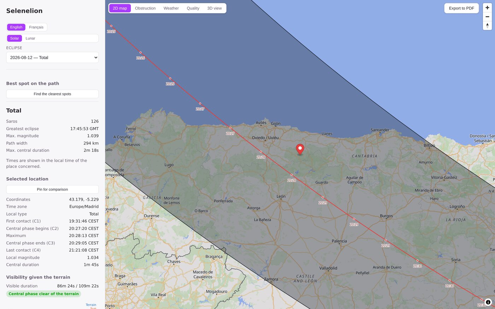
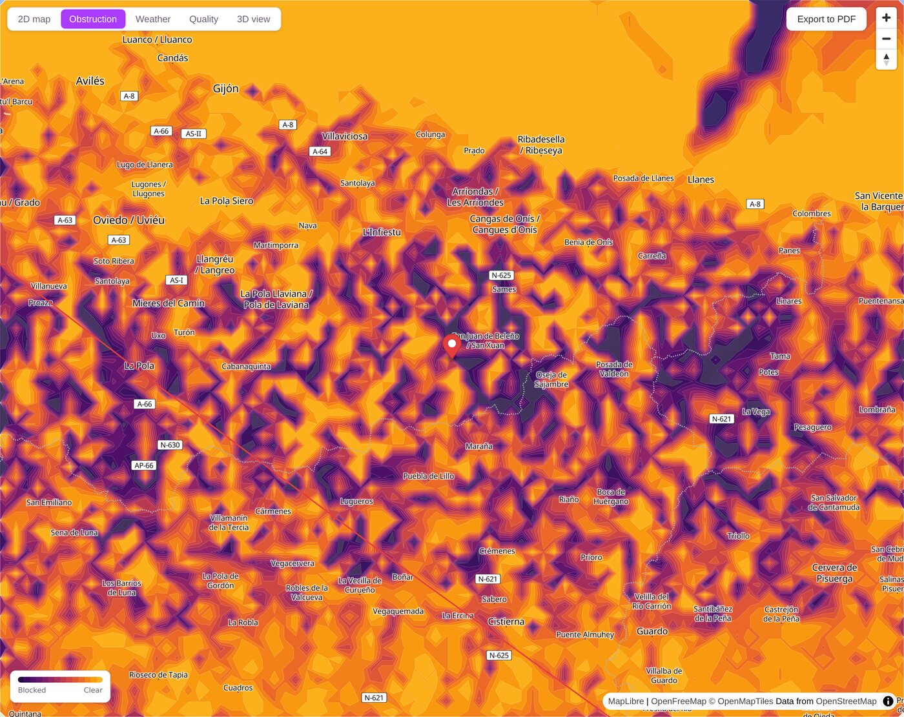
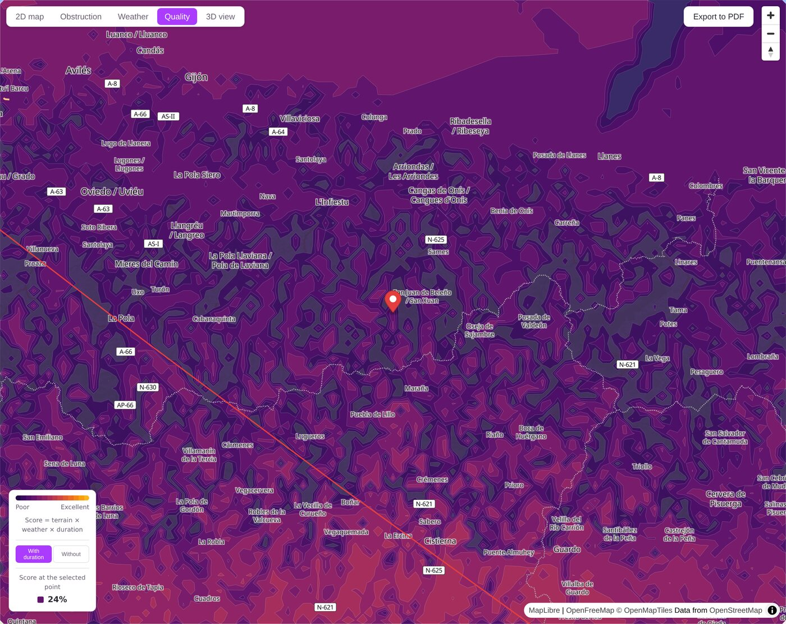
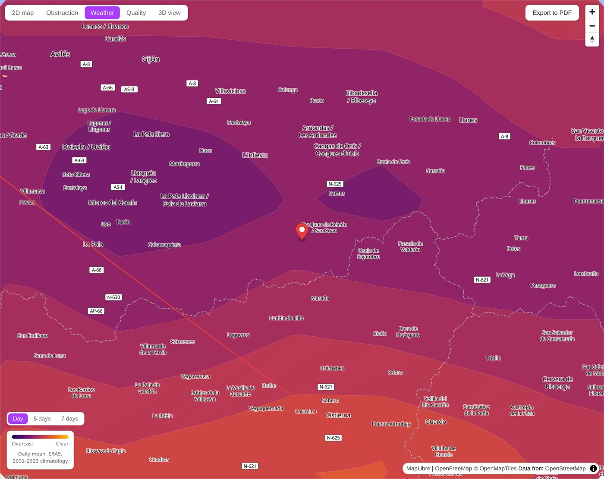
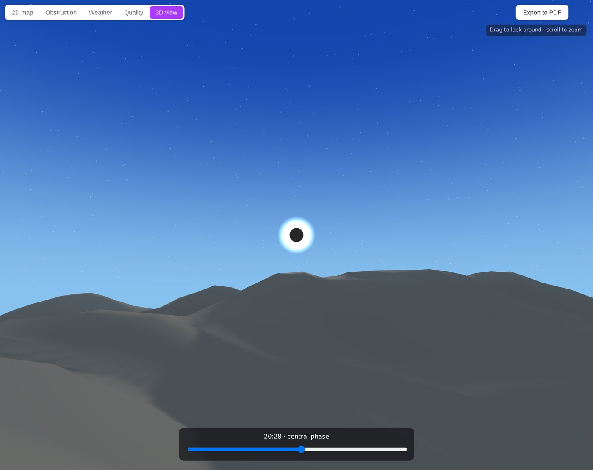
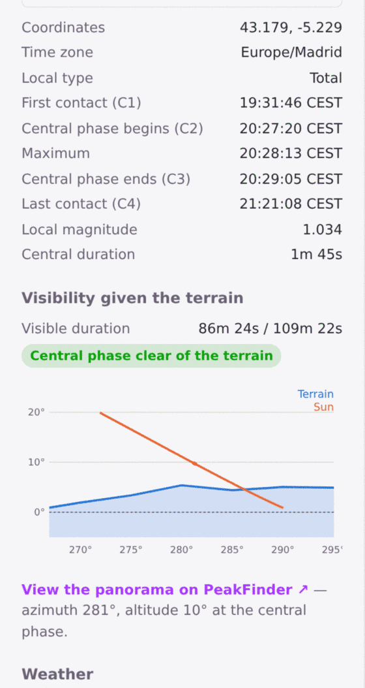

# Selenelion

**Plan where to stand for a solar or lunar eclipse.**



A *selenelion* is the rare sight of an eclipsed Moon and the Sun at once, each just above an
opposite horizon — possible only because refraction lifts both bodies slightly above where the
geometry says they should be. Horizons, where you happen to be standing on Earth, and both bodies
at once: that is what this tool is about.

Most eclipse tools answer *when*. This one answers *where*, by crossing the astronomy with the
real world you would be standing in:

- **Terrain obstruction** — a horizon profile ray-cast from elevation tiles, per point and across
  the whole viewport, so you can see whether a ridge hides the eclipse from a given spot. A clear
  sky is worth nothing behind a mountain.
- **Solar and lunar** — solar eclipses from Besselian elements; lunar eclipses computed from Sun
  and Moon ephemerides, with a per-point answer to "is the Moon even up here?".
- **Cloud climatology** — 23 years of ERA5 (2001–2023) as static tiles: *the odds* of clear sky at
  this place at this time of year. Deliberately not a forecast — for a date months or years out,
  the statistics are the only honest answer, and anyone travelling next week will check a real
  forecast anyway.
- **Quality score** — terrain × weather × duration-at-totality combined into one map, to answer
  "of the places I could reach, which is actually best?".
- **3D view** — the terrain and the eclipsed body from the observer's eye, in Three.js.
- **PDF export** — every map view at a much finer grid resolution than the interactive one,
  captured straight from the map itself so borders and labels composite correctly under the data.

Fully static: no backend, no accounts, no API keys. English by default, French available.

## The views

All screenshots: the 2026-08-12 total eclipse over the Picos de Europa, northern Spain — a
sunset eclipse, so the Sun sits only ~10° up at totality and the terrain matters enormously.

| Obstruction | Quality |
| :-- | :-- |
|  |  |
| How much of the eclipse clears the real horizon, cell by cell. Dark = a ridge is in the way. | Terrain × weather × duration at totality, in one number per cell. |

| Weather | 3D view |
| :-- | :-- |
|  |  |
| Odds of clear sky at that place, that time of year — 23 years of ERA5. | The sky from the observer's eye, scrubable through the whole eclipse. |



**The horizon chart** is where it comes together. The blue area is the real skyline in the
direction the eclipse happens; the orange line is the Sun's track through it. Where the orange
line drops below the blue, the eclipse is happening behind a mountain.

Here, at 43.179°N 5.229°W, 86m 24s of the 109m 22s eclipse clears the terrain, and totality
itself — 20:27:20 to 20:29:05 — clears the ridge with a few degrees to spare. The PeakFinder
link opens the same spot in a named-peak panorama, to check the answer against someone else's data.

<br clear="all">


## Getting started

```bash
npm install
npm run dev
```

Vite serves the app locally — see the terminal output for the URL.

### Climatology data

The weather views need roughly 800 MB of climatology tiles under `public/climatology` and
`public/climatology-hourly`. These are **not** tracked in git — generate them with:

```bash
npm run build:climatology
```

Everything else (eclipse computation, maps, terrain obstruction, 3D, PDF export) works without
them; only the weather views stay empty.

## Deployment

Fully static — any static host works. The one thing to plan for is the ~800 MB of climatology
tiles: they're gitignored, so a git-based deploy (Cloudflare Pages, Vercel, Netlify, ...) only
ever sees the app bundle, never the tile data. Two ways to handle that:

- **Same host** (simplest): upload `public/climatology` and `public/climatology-hourly` to the
  host's static output directly (outside git — e.g. `wrangler pages deploy dist/` after copying
  the tiles into `dist/` locally, or an equivalent direct-upload step for your host). Works as
  long as the host doesn't cap total deployment size below ~800 MB.
- **Separate host** (recommended for the tiles specifically, since they're large, static, and
  reads-only): put them in an object store with its own CDN — e.g. Cloudflare R2, which has no
  egress fees. Set `VITE_CLIMATOLOGY_BASE_URL` to that bucket's public URL (no trailing slash,
  e.g. `https://climatology.example.com`) as a build-time env var; unset, the app fetches tiles
  from its own origin exactly as it does in dev. The bucket needs a CORS policy allowing `GET`
  from the app's domain, since this is now a cross-origin fetch.

## Scripts

| Command | Description |
| --- | --- |
| `npm run dev` | Vite dev server with HMR |
| `npm run build` | Type-check (`tsc -b`) then production build |
| `npm run preview` | Preview the production build locally |
| `npm run test` | Test suite (Vitest) |
| `npm run typecheck` | Type-check only, no build |
| `npm run lint` | Lint (Oxlint) |
| `npm run build:climatology` | Generate the climatology tiles under `public/climatology*` |

## Data sources

- Solar eclipse circumstances — [`@astronomy-bundle`](https://github.com/nerdyharry/astronomy-bundle),
  from Besselian elements (Espenak/NASA GSFC conventions)
- Elevation — AWS Terrain Tiles (Terrarium, SRTM/GMTED derived)
- Base map — [OpenFreeMap](https://openfreemap.org/) vector tiles (OpenStreetMap data)
- Cloud cover — ERA5 reanalysis via [Open-Meteo](https://open-meteo.com/)'s public archive
